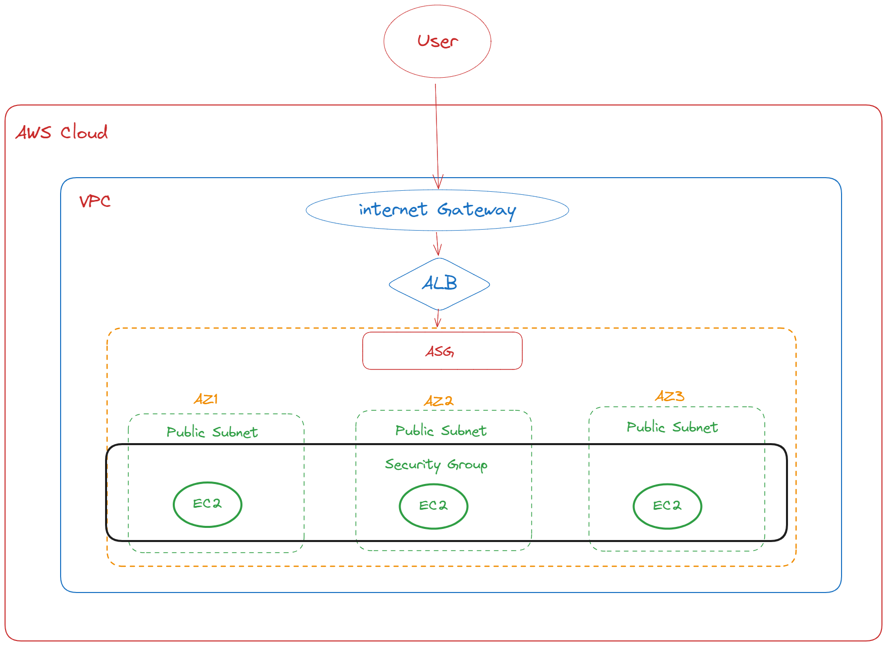

# Terraform module to deploy a highly available simple web application in the AWS Public Cloud infrastructure.

## Prerequisites:

 Terraform (1.2.*^)
 An AWS account
 A Terminal with the AWS CLI installed and configured

## Arch Diagram:



## Usage

```
1. terraform init
    To initialize current directory containing the Terraform configuration files. 
    This command downloads and installs any required modules and providers specified in the configuration files. 
    It also initializes a backend for storing Terraform state files, which can be used to store state remotely or locally.

2. terraform validate
    To Validate runs checks that verify whether a configuration is syntactically valid and internally consistent, regardless of any provided variables or existing state. 

3. terraform plan
    To creates an execution plan, which lets you preview the changes that Terraform plans to make to your infrastructure.

4. terraform apply
    To creates or updates resources in a Terraform configuration according to the configuration file.

4. terraform destroy
    Inverse of terraform apply in that it terminates all the resources specified in your Terraform state. It does not destroy resources running elsewhere that are not managed by the current Terraform project.
```

## What we can expect

1. This Terraform module will deploy AWS infrastructure to support a simple web application based on nginx with High availabilty and Scalable. 
2. This Terraform to automate the deployment of a high availability and scalability infrastructuren on AWS, creating 3 AZs in a custom VPC, an Elastic Load Balancer, Autoscaling Group.
3. The Elastic Load Balancer distributes incoming traffic to the instances created by the Autoscaling Group and the Autoscaling Group ensures the architecture has no single point of failure.
4. This is very much cost optimized as with scale according to load and with tag values for whole infra, we can calculate costs as well from cost explorer. 
5. This deployment method should be capable of bringing up and tearing down the entire infrastructure whenever we want.

## Extra Point

1. Our aim was to create a web service solution on aws with high availabilty, quick turn around, scalable and less costly. 
2. From implemetation point of view, main approach was to create this solution with Infra As a Code (Iac) and that can be done quickly within minutes and it can be Reusable for any other applciation deployment. 
3. Also in case of any changes in Infra Size or application changes, this solution will provide a quick turn around. 


## Further Improvment 

1. This solution can be further improved if seperate all main content into different modules like net(for all VPC related stuff), ALB ( for all ALB and autoscaling related stuff) and further more.
2. Avoid variables hard-coding.
3. Use Functions little more ( as I have already used at some places)
4. Use remote state, It’s ok to use the local state when experimenting, but use a remote shared state location for anything above that point.  
5. Enable debug/troubleshooting - When issues arise, we have to be quick and effective in gathering all the necessary information to solve them. You might find it helpful to set the Terraform log level to debug in these cases.


